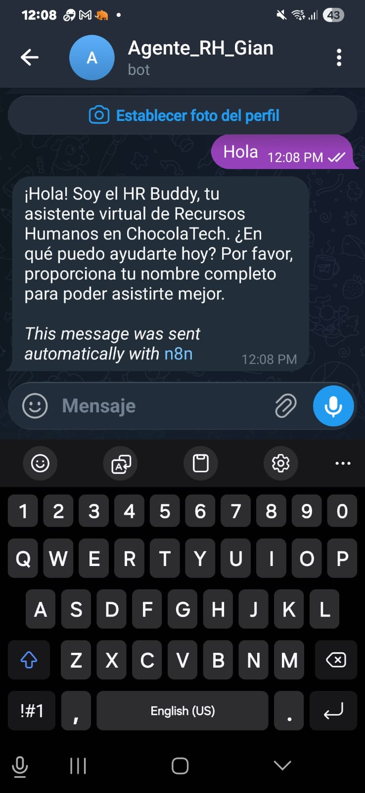
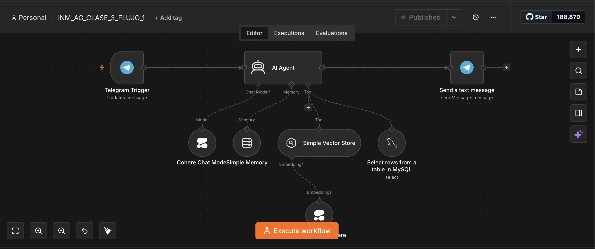
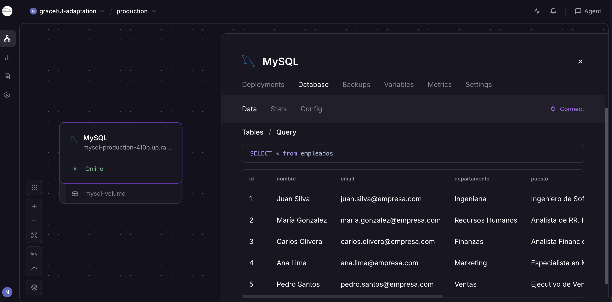

# Agente de RR.HH. en Telegram con n8n

Agente conversacional de Recursos Humanos desplegado en Telegram, 
construido con n8n, Cohere, Vector Store y MySQL en Railway.

## Demo

## Arquitectura del Workflow

## Base de Datos

## Stack Tecnológico

- **n8n** — orquestación del agente
- **Cohere** — modelo de lenguaje (LLM)
- **Simple Vector Store** — búsqueda semántica (RAG)
- **MySQL en Railway** — base de datos de empleados en producción
- **Telegram** — interfaz conversacional
- **Simple Memory** — contexto de conversación

## ¿Qué hace el agente?

- Saluda al empleado y solicita su nombre
- Consulta la base de datos de empleados en tiempo real
- Responde preguntas de RR.HH. usando búsqueda semántica
- Mantiene el contexto de la conversación
- Desplegado y funcional en producción vía Telegram

## Certificado

Inmersión Agentes de IA — Oracle ONE + Alura (2026)